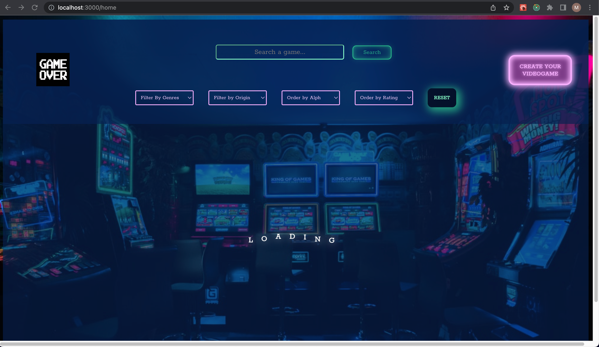
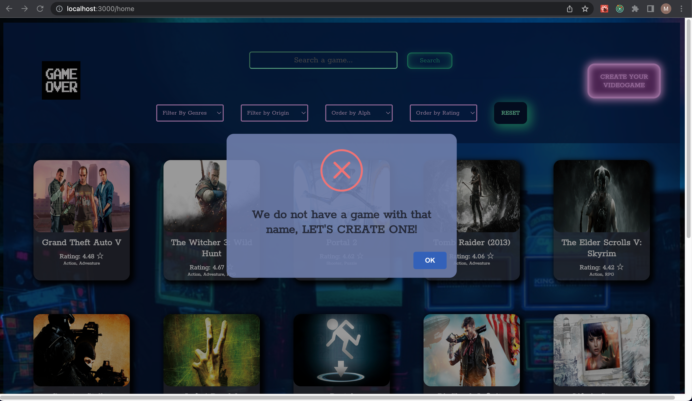
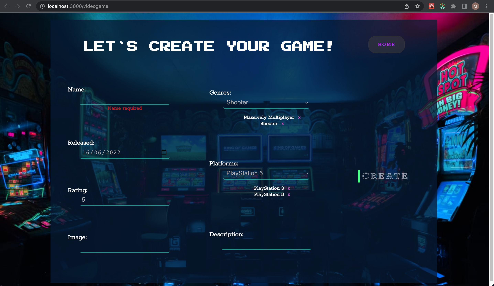

## THE VIDEOGAME APP

  

This is an app that consumes data from an API and a local database. It has a landing page from which you can access the main page, where all the videogames are displayed.

The app allows you to search by name, filter by gender and origin, and sort by alphabetical order and ranking. It also has a pagination.

By clicking each videogame, you can see more information and a link that redirects you to the official page.

It also gives the user the possibility to create their own videogame through a controlled form.

If you want to try it, download the repository and run the commands "npm install" and then "npm start".

 
🚀 Used technologies:
JavaScript | React | Redux | CSS | Node | Express | Sequelize | PostgreSQL

### CHECK IT OUT!

  
    
  
    
  
    
  
    
  
    
  

